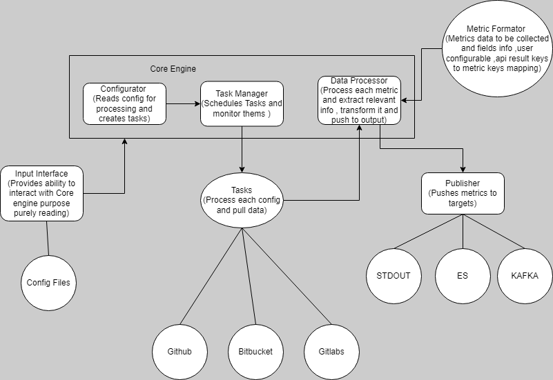

# **Gitops Plugin Design**
Gitops software will provide ability to monitor git repositories for commits , changes etc and send the data to observability platforms like snappyflow.
Gitops software will be provided as a standalone binary for different operating system. It will be supporting all major operating systems including linux(major distributions) , windows etc

## **High level diagram**

[^1]: Software flow is indicated by arrows in the image above

## **Components of the software**
### ***Input Interface*** 
Input interface will be reponsible for taking the input from the user. It will use a single config.yaml file for taking the input. It can be extended to include input from command line and rest APIs in future. Path for the config file will be same as the path of the software binary. This component will simply read the input file and throw error if input file not found or some issue in reading the input file. It will also validate the input file for correct input format. It will transfer the input data to configurator.

### ***Configurator***
Configurator will take the input data and generate tasks for each audit job. Before creating the task , it will dry run the credentials provided by the user to check for authentication. If any error , it will generate error in the log file. Once credentials are validated , task will be created for each of the audit job and provided to task manager to run it as per schedule.

### ***Task Manager***
Task manager is responsible for running the jobs at there scheduled time. It will also monitor the jobs and maintain job status and rerun some jobs or report error if job is faliing due to some reason. It will be reponsible for maintaining low overhead on the system while running the job i.e to maintain memory consumption and CPU loads under control by controlling the concurrency of the software.

### ***Task***
Each task is a audit job which will fetch data from the cloud VCS provider (like github, bitbucket etc) APIS's as defined in input and pass the response to data processor.

### ***Data Processor***
Data processor will be responsible for generating the required output data from the API's response as given by each task. It will use the metric formator for decoding each API's response to output format. Once output data is generated , it will pass the output to publisher.

### ***Metric formator***
Metric formator will be reponsbile for telling the program how to decode each API's response into output. It will consist of json file containing mapping for APIs reponse to ouput format.

### ***Publisher***
Publisher will send the data to target as defined in the input configuration. Target can be anything like elasticsearch , kafka etc

## **Important Points**
1. Software will take user's credentials from environment variable.It will be user's responsibility to add credentials to system environment variables. User credentials can also taken as base64 encoded in config.yaml (less preferred method)
2. Software will not be fetching old data and will only fetch newer data (from the time software is started)and send it to targets.
3. Software will be using log files for debugging and informational purpose which will be present at same location as the software binary.
4. All the builds will be provided as release through github actions.

## **Coding guidelines**
* Software will be using golang as primary language and will follow standard conventions guidelines as defined at [Uber's go coding guidelines](https://github.com/uber-go/guide/blob/master/style.md) , [Effective GO](https://go.dev/doc/effective_go) , [Official Go review comments](https://github.com/golang/go/wiki/CodeReviewComments) , [Practical Go](https://dave.cheney.net/practical-go/presentations/qcon-china.html) and [Package oriented Design](https://www.ardanlabs.com/blog/2017/02/package-oriented-design.html)